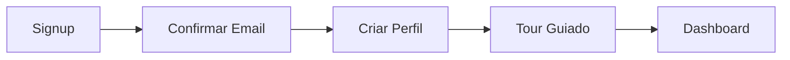
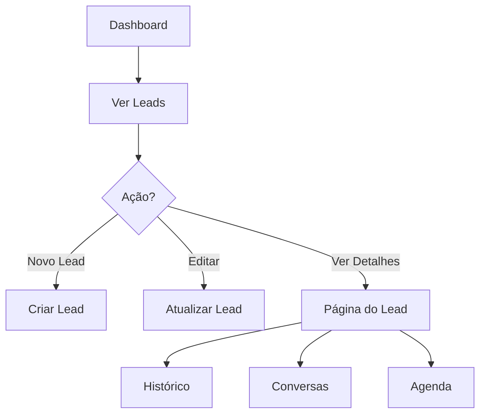
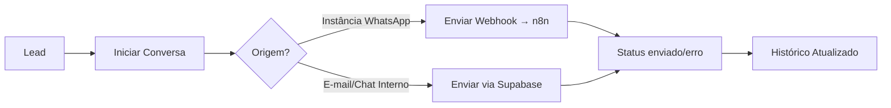

# Lyn CRM

**Versão:** 1.0.0-MVP  
**Responsável:** IA Company  
**Status:** 🚧 Em Desenvolvimento - Fase de Inicialização

---

## 📋 Visão Geral

O **Lyn CRM** é um sistema de gestão de relacionamento com clientes proprietário da IA Company, projetado para otimizar processos comerciais com recursos de automação e inteligência artificial. O sistema oferece gestão completa de leads, agenda, histórico de atendimentos e comunicação multicanal (WhatsApp, e-mail e chat).

Este é um CRM moderno e escalável, construído com tecnologias de ponta e arquitetura voltada para segurança, performance e experiência do usuário.

---

## 🎯 Objetivos do MVP

### Objetivos de Negócio

- Centralizar a gestão de leads e oportunidades comerciais
- Reduzir tempo de resposta ao cliente em 40%
- Aumentar taxa de conversão em 25% através de melhor qualificação
- Automatizar tarefas repetitivas, liberando vendedores para atividades estratégicas
- Prover visibilidade completa do funil de vendas

### Objetivos Técnicos

- Arquitetura escalável suportando até 10.000 leads simultâneos
- Tempo de resposta < 200ms para operações críticas
- Disponibilidade de 99.5%
- Integração segura com APIs externas (WhatsApp, e-mail)
- Implementação de RLS (Row Level Security) para proteção de dados

### Objetivos de Produto

- Interface intuitiva com curva de aprendizado < 1 hora
- Mobile-first design com responsividade completa
- Onboarding guiado para novos usuários
- Dashboard com métricas em tempo real
- Sistema de notificações inteligentes
- Suporte a mensagens multimídia (texto, imagem, áudio e documentos) no chat

---

## 🔐 Fluxo de Autenticação e Estrutura de Dados

### Arquitetura de Autenticação Supabase

O sistema utiliza **Supabase Auth** com Row Level Security (RLS) para garantir segurança e isolamento de dados. A arquitetura de autenticação é composta pelas seguintes tabelas:

#### **1. `auth.users`** (Gerenciada pelo Supabase)

Tabela nativa do Supabase que armazena credenciais e metadados de autenticação.

- Não é acessível diretamente via API por motivos de segurança
- Gerencia tokens JWT, sessions e refresh tokens

#### **2. `profiles`** (Schema: public)

Tabela de perfis de usuários com informações complementares.

```sql
CREATE TABLE public.profiles (
  id UUID PRIMARY KEY REFERENCES auth.users(id) ON DELETE CASCADE,
  first_name TEXT,
  last_name TEXT,
  company_name TEXT,
  avatar_url TEXT,
  updated_at TIMESTAMP WITH TIME ZONE DEFAULT NOW()
);
```

**RLS Policies:**

- ✅ Usuários podem ver apenas seu próprio perfil
- ✅ Usuários podem atualizar apenas seu próprio perfil
- ✅ Perfis são criados automaticamente via trigger no signup

#### **3. `leads`** (Schema: public)

Tabela principal de leads/oportunidades comerciais.

```sql
CREATE TABLE public.leads (
  id UUID PRIMARY KEY DEFAULT gen_random_uuid(),
  nome TEXT NOT NULL,
  email TEXT,
  origem_empresa TEXT,
  status status_lead DEFAULT 'novo',
  responsavel_id UUID REFERENCES auth.users(id),
  created_at TIMESTAMP WITH TIME ZONE DEFAULT NOW()
);
```

**Status possíveis:** `novo | contato | qualificado | perdido | ganho`

**RLS Policies:**

- ✅ Usuários veem apenas leads onde são responsáveis (`responsavel_id = auth.uid()`)
- ✅ Usuários podem criar leads atribuídos a si mesmos
- ✅ Usuários podem atualizar/deletar apenas seus próprios leads

#### **4. `agenda`** (Schema: public)

Tabela de agendamentos e compromissos vinculados a leads.

```sql
CREATE TABLE public.agenda (
  id UUID PRIMARY KEY DEFAULT gen_random_uuid(),
  user_id UUID NOT NULL REFERENCES auth.users(id),
  lead_id UUID REFERENCES leads(id),
  data TIMESTAMP WITH TIME ZONE NOT NULL,
  descricao TEXT,
  created_at TIMESTAMP WITH TIME ZONE DEFAULT NOW()
);
```

**RLS Policies:**

- ✅ Usuários veem apenas seus próprios agendamentos
- ✅ CRUD restrito ao proprietário do agendamento

#### **5. `conversas`** (Schema: public)

Tabela de conversas/threads de comunicação com leads.

```sql
CREATE TABLE public.conversas (
  id UUID PRIMARY KEY DEFAULT gen_random_uuid(),
  lead_id UUID REFERENCES leads(id),
  integration_instance_id UUID REFERENCES integration_instances(id),
  agent_id UUID REFERENCES agents(id),
  status TEXT NOT NULL DEFAULT 'novo'
    CHECK (status = ANY (ARRAY['novo', 'em_andamento', 'nao_respondida', 'finalizados'])),
  insights_ia TEXT,
  created_at TIMESTAMP WITH TIME ZONE DEFAULT NOW()
);
```

**Integrações suportadas:** vinculadas a `integration_instances` (ex.: provedores WhatsApp)

**Status possíveis:** `novo | em_andamento | nao_respondida | finalizados`

**RLS Policies:**

- ✅ Usuários veem apenas conversas de leads sob sua responsabilidade
- ✅ Vínculo via JOIN com tabela `leads`

#### **6. `mensagens`** (Schema: public)

Tabela de mensagens individuais dentro de conversas.

```sql
CREATE TABLE public.messages (
  id UUID PRIMARY KEY DEFAULT gen_random_uuid(),
  conversa_id UUID REFERENCES conversas(id),
  incoming BOOLEAN NOT NULL,
  body TEXT,
  media_base64 TEXT,
  media_type message_media_type DEFAULT 'conversation',
  message_id TEXT,
  status TEXT DEFAULT 'enviada',
  timestamp TIMESTAMP WITH TIME ZONE DEFAULT NOW()
);
```

**Status possíveis:** `enviando | enviada | recebida | lida | error`

**Tipos de mídia (`message_media_type`):** `conversation | imageMessage | audioMessage | documentMessage`

**RLS Policies:**

- ✅ Usuários veem mensagens apenas de conversas acessíveis
- ✅ Usuários podem editar/deletar apenas suas próprias mensagens

#### **7. `historico_atendimentos`** (Schema: public)

Registro histórico de interações e atividades com leads.

```sql
CREATE TABLE public.historico_atendimentos (
  id UUID PRIMARY KEY DEFAULT gen_random_uuid(),
  lead_id UUID NOT NULL REFERENCES leads(id),
  user_id UUID NOT NULL REFERENCES auth.users(id),
  tipo tipo_atendimento NOT NULL,
  descricao TEXT,
  created_at TIMESTAMP WITH TIME ZONE DEFAULT NOW()
);
```

**Tipos de atendimento:** `ligacao | email | reuniao | nota`

**RLS Policies:**

- ✅ Usuários veem apenas histórico de seus próprios atendimentos
- ✅ CRUD restrito ao proprietário do registro

---

### 🔒 Gestão de Permissões (RLS)

Todas as tabelas possuem **Row Level Security (RLS) habilitada** com políticas que garantem:

1. **Isolamento de dados por usuário** - via `auth.uid()`
2. **Acesso baseado em responsabilidade** - usuários só acessam leads atribuídos a eles
3. **Proteção contra escalação de privilégios** - policies impedem manipulação de dados de outros usuários
4. **Auditoria automática** - todos os registros possuem `created_at` e `user_id`

#### Padrão de Políticas RLS Implementadas

```sql
-- Exemplo: Política SELECT para leads
CREATE POLICY "Leads: Users can only see leads they are responsible for"
ON public.leads FOR SELECT
USING (auth.uid() = responsavel_id);

-- Exemplo: Política INSERT para leads
CREATE POLICY "Leads: Users can only insert leads for themselves"
ON public.leads FOR INSERT
WITH CHECK (auth.uid() = responsavel_id);
```

---

## 👥 Tipos de Usuário

O sistema suporta os seguintes tipos de usuário (a serem implementados via tabela `user_roles`):

### 1. **Admin**

- Acesso total ao sistema
- Gerenciamento de usuários e permissões
- Visualização de métricas globais
- Configurações de empresa e integrações

### 2. **Vendedor**

- Gestão de leads atribuídos
- Criação e acompanhamento de oportunidades
- Comunicação com clientes (WhatsApp, e-mail, chat)
- Visualização de métricas pessoais

### 3. **IA/Automação**

- Usuário técnico para integrações
- Execução de automações e workflows
- Envio automatizado de mensagens
- Qualificação automática de leads

> **Nota:** A implementação de roles será feita com uma tabela `user_roles` dedicada seguindo as melhores práticas de segurança, evitando armazenar roles em `profiles` ou `users`.

---

## 📦 Escopo de Módulos - MVP

| Módulo              | Descrição                                | Status | Prioridade |
| ------------------- | ---------------------------------------- | ------ | ---------- |
| **Autenticação**    | Login/Signup com Supabase Auth           |
| **Dashboard**       | Visão geral de métricas e atividades     |
| **Gestão de Leads** | CRUD completo de leads com filtros       |
| **Agenda**          | Calendário de compromissos               |
| **Conversas**       | Chat multicanal (WhatsApp, E-mail, Chat) |
| **Histórico**       | Timeline de interações com leads         |
| **Perfil**          | Edição de dados do usuário               |
| **Notificações**    | Sistema de alertas e lembretes           |

## 🛠 Requisitos Técnicos

### Frontend

- **Framework:** React 18+ com TypeScript
- **Bundler:** Vite
- **UI Library:** Material UI + Tailwind CSS
- **State Management:** React Query + Context API
- **Roteamento:** React Router v6
- **Formulários:** React Hook Form + Zod
- **Gráficos:** Recharts

### Backend

- **BaaS:** Supabase (PostgreSQL + Auth + Storage + Edge Functions)
- **API:** RESTful via Supabase Client
- **Real-time:** Supabase Realtime Subscriptions
- **Autenticação:** Supabase Auth com JWT
- **Storage:** Supabase Storage para avatares e anexos

### Database

- **SGBD:** PostgreSQL 15+ (via Supabase)
- **ORM:** Supabase JS SDK com TypeScript types
- **Migrações:** Supabase Migrations
- **Segurança:** Row Level Security (RLS) em todas as tabelas

### IA (Futuro)

- **LLMs:** Integração com OpenAI API / Anthropic
- **RAG:** Busca semântica com embeddings
- **Automação:** Edge Functions para workflows

### UX/UI

- **Design System:** Material UI customizado
- **Responsividade:** Mobile-first approach
- **Acessibilidade:** WCAG 2.1 AA compliance
- **Temas:** Light/Dark mode

---

## 🎨 Fluxo do Usuário

### 1. Onboarding



### 2. Gestão de Leads



### 3. Comunicação



### 4. Fluxo de envio de mensagens

1. A mensagem (texto ou anexo) é criada com status `enviando` na tabela `messages`.
2. O payload inclui dados do lead, do usuário autenticado e da instância de integração (`integration_instances.name`).
3. Um webhook para `n8n` processa o envio externo (ex.: provedores WhatsApp).
4. No sucesso, o status é atualizado para `enviada`; em falha, para `error`, exibindo feedback no chat.
5. Imagens, documentos (PDF) e áudios são embutidos em `media_base64`, respeitando o tipo informado em `media_type`.

---

## Métricas de Sucesso do MVP

### KPIs de Negócio

- **Taxa de Conversão:** Lead → Qualificado → Ganho
- **Tempo Médio de Resposta:** < 2 horas
- **NPS (Net Promoter Score):** > 50
- **Churn Rate:** < 5% ao mês

### KPIs Técnicos

- **Tempo de Carregamento:** < 2s (FCP)
- **Disponibilidade:** > 99.5%
- **Cobertura de Testes:** > 80%
- **Erros em Produção:** < 0.1%

### KPIs de Produto

- **Adoção de Funcionalidades:** > 70% usuários ativos
- **Tempo até Primeira Ação:** < 5 minutos
- **Sessões por Usuário/Dia:** > 3
- **Taxa de Retenção (30 dias):** > 60%

---

## ⚠️ Riscos e Mitigações

| Risco                              | Probabilidade | Impacto | Mitigação                                            |
| ---------------------------------- | ------------- | ------- | ---------------------------------------------------- |
| **Falha de autenticação Supabase** | Baixa         | Alto    | Monitoramento de uptime, fallback para modo offline  |
| **Escalabilidade de mensagens**    | Média         | Alto    | Implementar fila com Edge Functions, rate limiting   |
| **Vazamento de dados via RLS**     | Baixa         | Crítico | Testes extensivos de políticas, auditorias regulares |
| **Integração WhatsApp instável**   | Média         | Médio   | Sistema de retry, webhooks com idempotência          |
| **Performance com muitos leads**   | Média         | Médio   | Paginação, lazy loading, índices otimizados          |
| **Complexidade de UX**             | Alta          | Médio   | Testes de usabilidade, onboarding interativo         |

### Plano de Contingência

- **Backup diário automatizado** do banco de dados
- **Monitoramento 24/7** com alertas via e-mail/SMS
- **Documentação de runbooks** para incidentes comuns
- **Rollback automático** em caso de deploy com falhas críticas

---

## 📦 Entregáveis do MVP

### Sprint 1 - Fundação (Concluído)

- ✅ Setup do projeto React + Vite + TypeScript
- ✅ Integração com Supabase
- ✅ Estrutura de pastas e arquitetura
- ✅ Configuração de tema Material UI
- ✅ Documentação técnica (este README)

### Sprint 2 - Autenticação (Próximo)

- [ ] Telas de Login/Signup
- [ ] Fluxo de recuperação de senha
- [ ] Criação automática de perfil
- [ ] Proteção de rotas
- [ ] Sessão persistente

### Sprint 3 - Core Features

- [ ] Dashboard com métricas
- [ ] CRUD de Leads com filtros
- [ ] Visualização de pipeline
- [ ] Formulários com validação

### Sprint 4 - Comunicação

- [ ] Chat interno
- [ ] Histórico de atendimentos
- [ ] Timeline de atividades
- [ ] Sistema de notificações

### Sprint 5 - Agenda & Finalizações

- [ ] Calendário de compromissos
- [ ] Integração com Google Calendar (opcional)
- [ ] Perfil de usuário
- [ ] Testes E2E
- [ ] Deploy em produção

---

## 🚀 Próximos Passos Após MVP

### Fase 2 - Automação

- Workflows automatizados com triggers
- Envio automático de mensagens via WhatsApp/E-mail
- Qualificação automática de leads com IA
- Chatbot para atendimento inicial

### Fase 3 - Analytics & BI

- Dashboards avançados com Metabase/PowerBI
- Relatórios personalizados
- Exportação de dados (CSV, PDF)
- Previsão de vendas com ML

### Fase 4 - Integrações

- Integração com Stripe/PagSeguro
- Sincronização com Google Workspace
- Webhooks para sistemas externos
- API pública com documentação Swagger

### Fase 5 - Mobile

- Aplicativo React Native
- Notificações push
- Modo offline
- Geolocalização para check-ins

---

## 📚 Estrutura do Projeto

```
lyn-crm/
├── src/
│   ├── components/       # Componentes reutilizáveis
│   ├── pages/           # Páginas/rotas
│   ├── services/        # Serviços de API (Supabase)
│   ├── hooks/           # Custom React hooks
│   ├── theme/           # Configuração de tema MUI
│   ├── utils/           # Funções utilitárias
│   ├── App.tsx          # Componente raiz
│   └── main.tsx         # Entry point
├── supabase/
│   └── migrations/      # Migrações de banco de dados
├── public/              # Assets estáticos
└── README.md            # Este arquivo
```

---

## 🤝 Contribuindo

Este é um projeto proprietário da **IA Company**. O desenvolvimento é dividido em sessões independentes. Para contribuir:

1. Revise os requisitos da sessão atual
2. Implemente funcionalidades conforme especificação
3. Documente alterações no código
4. Submeta para revisão

---

## 📄 Licença

**Proprietary Software** - © 2024 IA Company. Todos os direitos reservados.

---

## 📞 Contato

Para dúvidas técnicas ou suporte:

- **Email:** dev@iacompany.com
- **Slack:** #lyn-crm-dev

---

**Última Atualização:** 2024-01-XX  
**Próxima Revisão:** Após conclusão do Sprint 2

